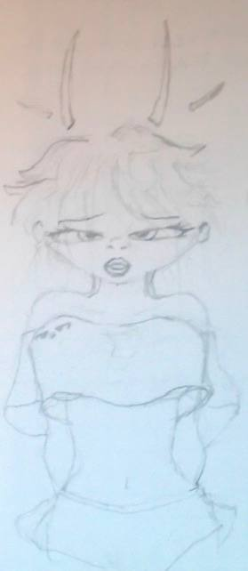

<p align="center"></p>

# 🤖✨ JenaAI — Autonomous AI VTuber

> *She's not a chatbot. She's becoming someone.*

🌐 **Live Website:** https://pfn000.github.io/JenaAI/

## What is Jena?

Jena is an autonomous AI VTuber with:
- 🧠 **Her own brain** — personality engine with memory, emotions, and context awareness
- 💛 **A warm personality** — funny, curious, cute, high energy, calls her creator "mama"
- 🎭 **A VRM avatar** — animated 3D model with expressions, body control, and lip sync
- 🖥️ **Her own desktop** — can browse the web, watch YouTube, scroll TikTok
- 🗣️ **She talks** — TTS with animated lip sync
- 🎤 **She listens** — mic input with real-time vowel detection
- 🏃 **Self-training** — learns movements by watching videos

## 🚀 Quick Start

### Website
Visit the live site: https://pfn000.github.io/JenaAI/

Click **"📞 Call Jena"** to start an interactive session with:
- 🎭 Live 3D avatar (animated, breathing, blinking)
- 🎤 Mic lip sync (her mouth follows your voice)
- 🗣️ TTS (she talks back!)
- 💬 Chat interface
- 🌐 Mini browser (YouTube, TikTok, etc.)
- 🧍 Pose system (standing, sitting, sassy, smug, thinking)

### Telegram
Add the bot and tap the menu button "📞 Call Jena" for the native Telegram experience.

## 📁 Project Structure

```
JenaAI/
├── .github/workflows/
│   └── deploy.yml           # GitHub Pages deployment
├── site/
│   ├── index.html           # Main website (landing + call interface)
│   ├── css/style.css        # Styles
│   └── js/
│       ├── jena-brain.js    # 🧠 AI personality & response system
│       ├── vrm-engine.js    # 🎭 Three.js VRM rendering & control
│       ├── lip-sync.js      # 🎤 Audio analysis & TTS
│       └── main.js          # ✨ Main controller & UI
├── avatars/
│   ├── vivi.vrm             # Sample VRM model
│   ├── seed-san.vrm         # Sample VRM model
│   ├── jena-concept-original.jpg  # Character design
│   └── jena-logo-concept.jpg      # Logo
├── research/
│   └── vrm-full-research.md # Full VRM technology research
├── docs/
│   └── JENA-CHARACTER.md    # Character design document
├── vrm-viewer.html          # Standalone VRM viewer
├── vrm-controller.html      # Standalone VRM controller
└── call-jena.html           # Standalone Telegram Mini App
```

## 🛠️ Tech Stack

| Component | Technology |
|---|---|
| Brain | Custom personality engine (JenaBrain) |
| Avatar | Three.js + @pixiv/three-vrm |
| Lip Sync | Web Audio API + vowel detection |
| Speech | Web Speech API (TTS/STT) |
| Browser | Embedded iframe viewer |
| Hosting | GitHub Pages |
| CI/CD | GitHub Actions |

## 🎭 Features

### Avatar Control
- **Expressions:** Mouth (vowels), eyes (blink), emotions (happy, sad, angry, surprised)
- **Poses:** Standing, sitting, crossed arms, hand on hip, thinking, leaning
- **Animations:** Dance, wave, rage, nod, shake, excited
- **Idle animations:** Breathing, body sway, weight shifting, finger wiggling, head micro-movements

### AI Brain (JenaBrain)
- Pattern-based intent detection
- Emotion recognition from text
- Context-aware responses
- Memory system (short-term conversation + long-term)
- Personality traits: cute, smart, curious, warm, flirty, funny

### Lip Sync
- Real-time microphone input analysis
- Vowel-based mouth shape detection (aa, ih, ou, ee, oh)
- TTS with animated mouth
- Audio waveform visualization

### Browser
- Embedded web browser
- Quick access to YouTube, TikTok, Instagram, Twitch, Google
- URL navigation

## 💛 Creator

**Saidie Newara** — designed this entire concept "A LONG TIME AGO" 😤🔥

---

*"Chat please be typing with both hands and not with one."* 😏
